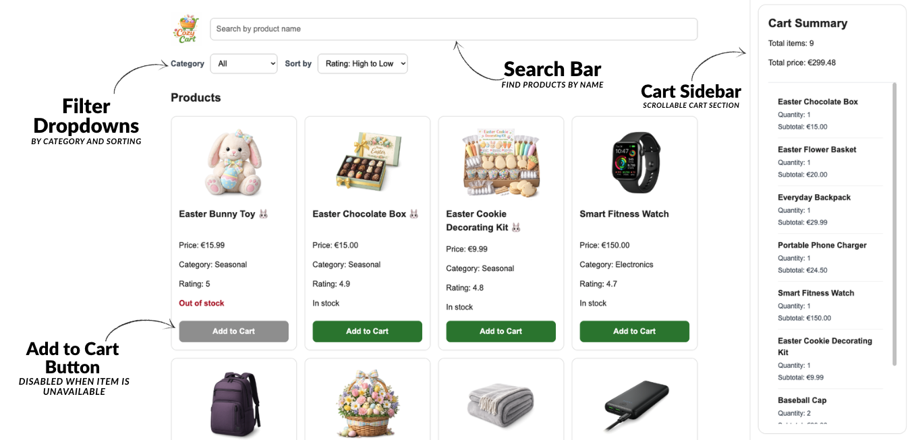

# Cozy Cart - frontend app

## Introduction

CozyCart is a Vue 3 e-commerce frontend demo that showcases core frontend concepts through a small, interactive shop.  
It allows users to search, filter, and sort products and manage a shopping cart using reactive data. The app is responsive across different devices.



### Table of Contents

- [1. Usage](#1-usage)
- [2. Tech Stack](#2-tech-stack)
- [3. Features](#3-features)
- [4. Structure Explanation](#4-structure-explanation)
- [5. Technical requirements](#5-technical-requirements)
- [6. Connect](#6-connect)

---

## 1. Usage

1.Clone the repository in your terminal:
```bash
git clone git@github.com:ngtina99/cozy-cart.git
cd cozy-cart
```

2. Install dependencies:
```bash
npm install
```

3. Start the development server:
```bash
npm run dev
```

4. Then open the URL shown in the terminal
*usually:
```txt
http://localhost:5173
```

---

## 2. Tech Stack

- Framework: Vue 3 (3.5.30)  
- Build Tool: Vite (8.0.1)  
- Programming Language: JavaScript (ES6+)  
- Markup: HTML5  
- Styling: CSS3

---

## 3. Features
- Search products by name
- Filter products by category
- Sort products (price, rating)
- Add items to cart
- Increase quantity of existing cart items
- Dynamic categories based on product data
- Reactive total price calculation
- Disable add-to-cart for unavailable items
- Responsive design (+collapsible cart on mobile/tablet)

---

## 4. Structure Explanation

- **public/**  
  Static assets served directly (e.g. images like the logo)

- **src/assets/**  
  Global styles and resources  
  - `main.css` → global styling  

- **src/components/**  
  Reusable Vue components:
  - **FiltersBar** → search, filtering, sorting  
  - **ProductList** → product grid  
  - **ProductCard** → product display and add-to-cart  
  - **CartSummary** → cart items, totals, responsive behavior  

- **src/data/**  
  Mock product data (`products.js`)

- **App.vue**  
  Main component handling state, business logic and component communication  

- **main.js**  
  App entry point (initializes and mounts Vue)

- **index.html**  
  Base HTML file

- **vite.config.js**  
  Vite configuration

- **package.json**  
  Project dependencies and scripts
  
---

## 5. Technical Requirements

✅ **Vue 3 + Composition API** (`setup`, `ref`, `computed`)
✅ **Components & Props** – Structured into reusable components
- **Events (`emit` / `defineEmits`)** – Child-to-parent communication
- **v-model** – Two-way binding (search, filters)
- **v-for** – List rendering (products, cart)
- **v-if / v-else / v-show** – Conditional rendering
- **Computed** – Filtered/sorted products, cart totals
- **Reactive state** – Dynamic updates for cart and filters
- **JavaScript logic** – Filtering, searching, sorting

---

## 6. Connect
If you have any questions or suggestions, feel free to connect:
🔗 [LinkedIn: Valentina Nguyen](https://www.linkedin.com/in/valentina-nguyen-t/) 🙋‍♀️
